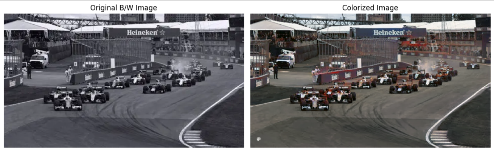
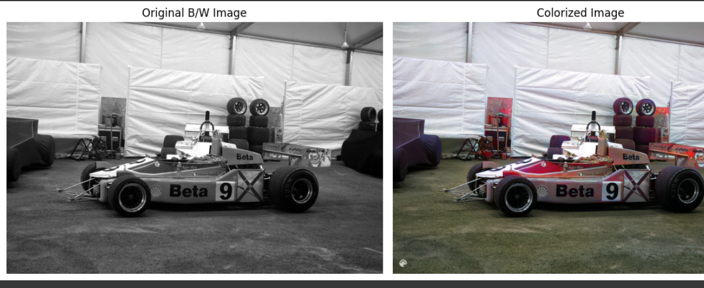
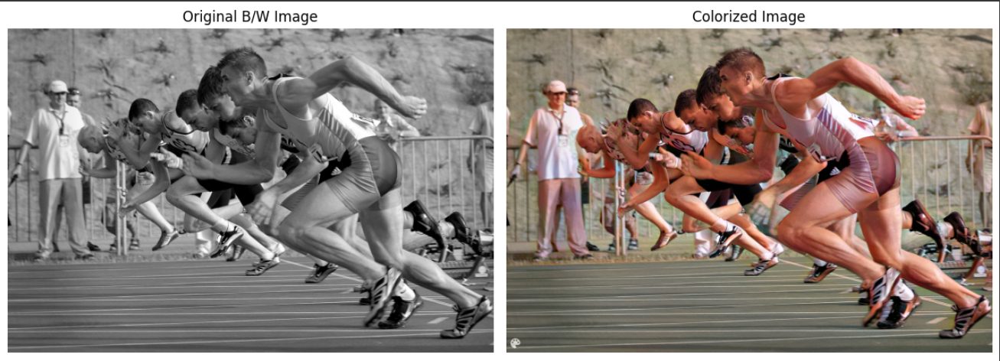
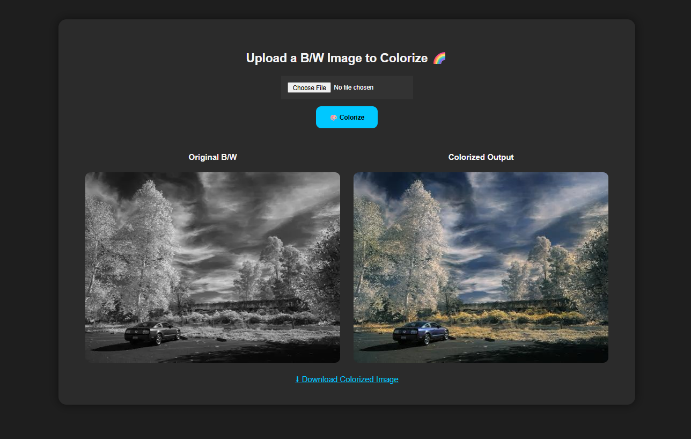

# 🎨 Colourize-with-DeOldify

Colorize black-and-white images using **DeOldify**, a powerful deep learning model based on:

- ⚙️ **NoGAN training** (Perceptual Pretraining + GAN Refinement)
- 🧠 **ResNet34 encoder** + **UNet decoder** with **Self-Attention**
- 🐍 Built using the **FastAI** framework
- 🎛️ Adjustable **Render Factor** for fine control over output detail

Utilizes **transfer learning**, **VGG-based perceptual loss**, and **Generative Adversarial Networks (GANs)** to transform grayscale images into rich, realistic color renderings.

---

## 🖼️ Sample Results

<table>
  <tr>
    <td align="center">
       
      <b>Sample 1</b>
    </td>
  </tr>
  <tr>
    <td align="center">
       
      <b>Sample 2</b>
    </td>
  </tr>
  <tr>
    <td align="center">
       
      <b>Sample 3</b>
    </td>
  </tr>
</table>

---
### 🌐 Web Interface

   
  <i>🖥️ Simple, intuitive web interface for easy image upload and colorization</i>

---

## 🚀 Features

- 🖱️ **One-click colorization** of grayscale images
- 🌍 **Web-based UI** with drag-and-drop support
- 🎨 **High-fidelity outputs** using pre-trained artistic models
- ⚡ **Colab-ready** deployment with minimal setup
- 🧩 **GPU acceleration** for faster rendering

---

## ⚙️ Quick Start

1. Open `main.ipynb` in Google Colab  
2. Run all cells sequentially  
3. Access the web interface via the generated **ngrok URL**  
4. Upload your grayscale image and watch it turn to color! 🌈

---

## 🔍 How It Works

This project utilizes **DeOldify's Artistic Colorizer**, which blends:

- A **ResNet34 encoder** for feature extraction  
- A **UNet decoder with self-attention** to capture context and restore color  
- **NoGAN training strategy**, where the model is first perceptually pre-trained before being fine-tuned with a GAN for realistic outputs  
- **VGG-based perceptual loss** to enhance semantic understanding during colorization  

---

## 🙏 Acknowledgments

Built on the incredible research of [DeOldify](https://github.com/jantic/DeOldify) by **Jason Antic**.

---
